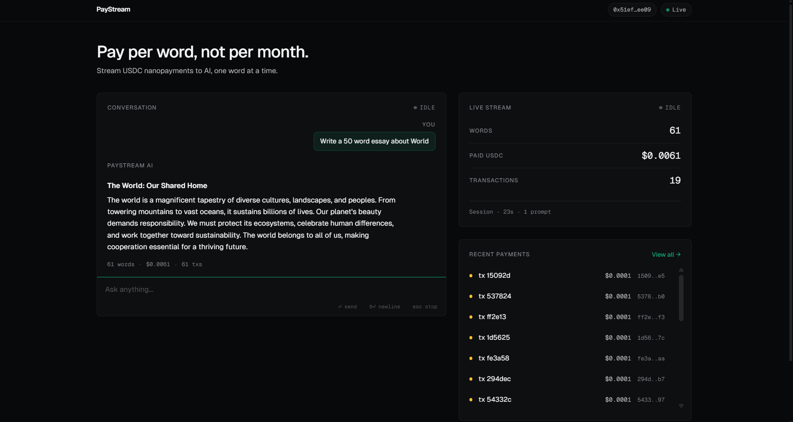

# PayStream

**Pay per word, not per month.**

_If data streams, money should too._

[](https://paystream-chat.vercel.app)
[](https://lablab.ai)
[](https://testnet.arcscan.app)
[](./LICENSE)
[](https://nextjs.org)

---

## What is PayStream?

PayStream is a pay-per-word AI chat app. Instead of paying $20/month for a flat ChatGPT subscription, you pay **$0.0001 in USDC for each word the AI writes** — settled on-chain in real time, while the response is still streaming.

Every word the model emits triggers a **real Circle Nanopayment on Arc Testnet** via an EIP-3009 authorization signed by a Circle Developer-Controlled Wallet. The settlement flow is continuous: as tokens flow from the LLM into the UI, value flows on-chain. Stop the response mid-stream and the payments stop with it — you are billed for exactly what the model produced, not a rounded-up minute, not a flat credit, not a monthly plan you half-used.

This is a concrete demonstration of the thesis behind the Agentic Economy on Arc: **machines paying machines in real time, with sub-cent transactions that no traditional payment rail can support.** A single chat response can easily produce 100+ on-chain authorizations, batched into dozens of settlements — all visible on the Arc Block Explorer.

---

## Why nanopayments?

Traditional rails (Stripe, Visa, ACH) have per-transaction floors measured in _cents_, not tenths of a cent — their fee structure and settlement overhead make a $0.0001 payment economically absurd. Even modern L1s choke on sub-cent micropayments once you account for gas. Nanopayments on Arc collapse both problems at once: settlement is cheap enough that $0.0001 is a meaningful unit of value, and Circle's Gateway lets the operator batch hundreds of authorizations into single on-chain transactions without sacrificing the per-authorization granularity. That combination — **per-token pricing, real settlement, no batching fiction** — is what makes an actual agentic economy possible.

---

## Demo

> **Live:** [paystream-chat.vercel.app](https://paystream-chat.vercel.app)



_Ask the model anything. Watch the word counter tick up, the USDC total climb, and new tx hashes land in the transaction feed — each one clickable into [testnet.arcscan.app](https://testnet.arcscan.app)._

---

## How it works

```
┌─────────┐    prompt     ┌──────────────┐   stream   ┌────────────────┐
│ Browser │ ────────────▶ │ Next.js API  │ ─────────▶ │ Anthropic      │
└─────────┘               │ /api/chat    │            │ Claude Haiku   │
     ▲                    └──────┬───────┘            └────────────────┘
     │                           │ per word
     │                           ▼
     │                    ┌──────────────┐   EIP-3009   ┌──────────────┐
     │   SSE token +      │ Circle       │   signature  │ Circle       │
     └── tx-hash events ◀─│ Nanopayment  │ ◀──────────▶ │ W3S Wallet   │
                          │ Batcher      │              │ (server-side)│
                          └──────┬───────┘              └──────────────┘
                                 │ settle batch
                                 ▼
                          ┌──────────────────────────────────────────┐
                          │ Circle Gateway  →  Arc Testnet (5042002) │
                          └──────────────────────────────────────────┘
```

1. **User sends a prompt** through the chat UI.
2. **Backend streams the response** from Anthropic Claude Haiku via the streaming API.
3. **Each word emitted triggers a Circle Nanopayment** authorization at the configured per-word price ($0.0001 USDC).
4. **Authorizations are signed as EIP-3009 `transferWithAuthorization` payloads** — proper EIP-712 typed-data signing, executed inside Circle's Developer-Controlled Wallets so the private key never leaves Circle's custody.
5. **Circle Gateway batches and settles** the authorizations on Arc Testnet.
6. **The transaction feed updates live** over SSE: the browser sees each new tx hash as settlements confirm on-chain.

---

## Tech Stack

| Layer             | Choice                                                            |
| ----------------- | ----------------------------------------------------------------- |
| **Frontend**      | Next.js 14 (App Router), TypeScript, Tailwind CSS, react-markdown |
| **AI**            | Anthropic Claude Haiku via streaming API (`@anthropic-ai/sdk`)    |
| **Payments**      | Circle Nanopayments + Circle Developer-Controlled Wallets (W3S)   |
| **Batching**      | `@circle-fin/x402-batching`, `@x402/core`, `@x402/evm`            |
| **Blockchain**    | Arc Testnet (Chain ID 5042002)                                    |
| **Settlement**    | Circle Gateway with EIP-3009 `transferWithAuthorization`          |
| **Signing**       | `viem` for EIP-712 typed-data construction                        |
| **Explorer**      | [testnet.arcscan.app](https://testnet.arcscan.app)                |

---

## Architecture

The server composes three independent streams into one user-facing event stream: an LLM token stream from Anthropic, a payment-authorization stream keyed off each word boundary, and a settlement-confirmation stream coming back from Circle Gateway. The frontend consumes all three over a single SSE channel and renders them as a streaming message, a live USDC counter, and a transaction feed side-by-side.

The interesting piece is the **W3S → BatchEvmScheme adapter** in [lib/circle-signer.ts](./lib/circle-signer.ts) — about 30 lines that bridge an API mismatch worth calling out. Circle's Developer-Controlled Wallets SDK is designed around secure key custody: you never see the private key, you just ask the SDK to sign things. The `@circle-fin/x402-batching` SDK, on the other hand, expects a raw-key signer conforming to `BatchEvmScheme`. The adapter wraps `signTypedData` calls through W3S so the batcher can drive EIP-3009 authorizations without the private key ever leaving Circle's custody. This is the fix that turns "two Circle products that should work together" into "they actually do."

---

## Hackathon Submission Criteria

- ✅ **Circle Nanopayments integration** — real, not mocked
- ✅ **Settlement on Arc Testnet** (Chain ID 5042002)
- ✅ **Sub-cent per-action pricing** — $0.0001 USDC per word
- ✅ **50+ on-chain authorizations per typical demo session** — each word triggers a separate EIP-3009 authorization; Circle Gateway batches these into multiple on-chain settlements visible on the operator wallet's Arc Explorer page
- ✅ **Real on-chain TXs visible on Arc Block Explorer** — every settlement is a clickable hash in the UI

---

## Local Setup

### Prerequisites

- Node.js 20+
- A Circle Console account with three sandbox wallets on **ARC-TESTNET**
- USDC deposited into the operator wallet's GatewayWallet position (use [scripts/deposit-to-gateway.ts](./scripts/deposit-to-gateway.ts))
- An Anthropic API key

### Steps

```bash
# 1. Clone
git clone https://github.com/mettin4/paystream-chat.git
cd paystream-chat

# 2. Install
npm install

# 3. Configure
cp .env.example .env.local
# then fill in the values — see below
```

Required environment variables (all server-side; the one `NEXT_PUBLIC_` var is bundled into the browser and must remain non-secret):

| Variable                           | What it is                                                                          |
| ---------------------------------- | ----------------------------------------------------------------------------------- |
| `CIRCLE_API_KEY`                   | Sandbox API key from [console.circle.com](https://console.circle.com)               |
| `CIRCLE_ENTITY_SECRET`             | 32-byte hex entity secret, registered with Circle via `registerEntitySecretCiphertext` |
| `CIRCLE_OPERATOR_WALLET_ID`        | UUID of the Circle wallet that funds user prompts                                   |
| `CIRCLE_OPERATOR_WALLET_ADDRESS`   | On-chain address of that operator wallet                                            |
| `CIRCLE_RECIPIENT_ADDRESS`         | Address that receives nanopayments (must be different from the operator)            |
| `NEXT_PUBLIC_ARC_EXPLORER_URL`     | Arc block explorer base URL, e.g. `https://testnet.arcscan.app`                     |
| `ANTHROPIC_API_KEY`                | Anthropic API key from [console.anthropic.com](https://console.anthropic.com)       |

```bash
# 4. (First time only) fund the operator's Gateway position
npx tsx scripts/deposit-to-gateway.ts

# 5. Run
npm run dev

# 6. Open
# http://localhost:3000
```

---

## Project Structure

```
paystream-chat/
├── app/
│   ├── api/
│   │   ├── chat/            # SSE endpoint: streams tokens + payments together
│   │   └── transactions/    # Recent on-chain tx feed
│   ├── layout.tsx
│   └── page.tsx
├── components/
│   ├── ChatInterface.tsx    # Streaming chat UI, consumes SSE
│   ├── PaymentCounter.tsx   # Live word count + USDC total
│   └── TransactionFeed.tsx  # Live tx-hash feed, linked to arcscan
├── lib/
│   ├── anthropic.ts         # Claude Haiku streaming client
│   ├── circle.ts            # Circle W3S + x402 batcher setup
│   ├── circle-signer.ts     # W3S → BatchEvmScheme adapter (the key bridge)
│   ├── sessions.ts          # Per-session payment accounting
│   └── session-cookie.ts
├── scripts/
│   ├── deposit-to-gateway.ts          # Fund the operator's Gateway position
│   ├── deposit-operator.ts            # On-chain USDC top-up
│   ├── generate-entity-secret-ciphertext.ts
│   ├── spike-gateway.ts               # Manual Gateway smoke test
│   └── test-payment.ts                # Single-authorization round-trip
├── middleware.ts            # Session cookie issuance
├── .env.example
└── README.md
```

---

## Roadmap / Future Work

- **Per-user wallets.** The current demo uses a shared operator wallet that fronts every user's prompt. A production version would provision a Circle wallet per user at sign-up and bill each user's own balance.
- **True per-word x402 HTTP flow.** Authorizations are currently batched per prompt; the end state is a real per-word x402 payment gate where each word is gated by its own HTTP 402 round-trip. The batching SDK already does the heavy lifting — this is a wiring change, not an architectural one.
- **User-controlled wallets via wagmi + EIP-3009 pre-authorization.** Move signing fully client-side: connect with wagmi, issue a capped EIP-3009 pre-authorization, and spend against it as the user types. Keeps the UX instant while eliminating the server-side custody step entirely.

---

## Acknowledgments

- **Circle** — for Nanopayments, Developer-Controlled Wallets, Gateway, and the x402 batching SDK
- **Arc** — for a testnet that actually makes sub-cent settlement feel instant
- **Anthropic** — for Claude Haiku's streaming API
- **lablab.ai** — for hosting the Agentic Economy on Arc hackathon

---

## License

[MIT](./LICENSE) — © 2026 Team MTHOCP
